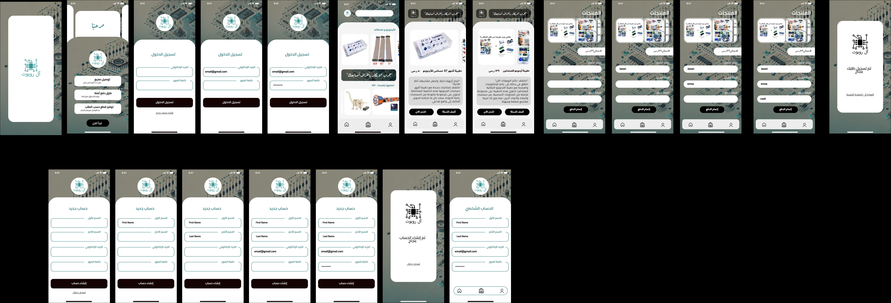
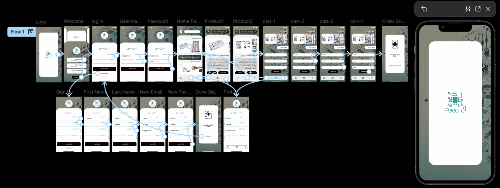

# AlRobot Mobile App UI/UX Concept

## Overview

This project presents a UI/UX design concept for a mobile application for the AlRobot website. The design focuses on creating a modern, intuitive, and user-friendly shopping experience for mobile users.

This project represents a design concept only and is not an official AlRobot application.

---

## Screens

- Splash Screen
- Welcome Screen
- Login
- Sign Up
- Home
- Product Details
- Shopping Cart
- Profile

---

## Tools Used

- Figma

---

## Preview

---

## Figma

View the interactive prototype:

**https://www.figma.com/design/0mA2fgW3d6VWMNMdQB0LjI/AlRobot?node-id=0-1&t=E3TdpWvP0yMtGQNl-1**

---

## Website

AlRobot Website:

**[https://your-website-link](https://salla.sa/al-robot/category/OlXdea)**

---

## Disclaimer

This repository contains a UI/UX design concept for a mobile application developed for the AlRobot website. It is an independent design project and is not an official product or service of AlRobot.

---

## Author

Raghad Mohammed Oteef
